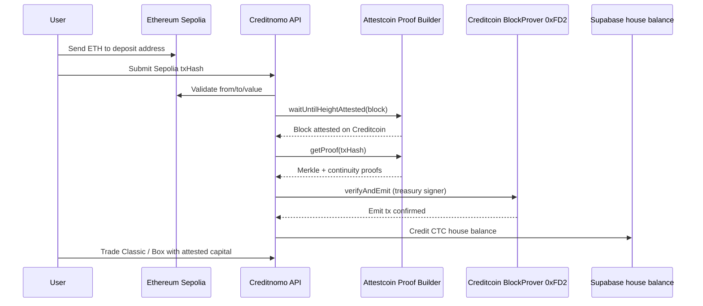

# Attestcoin Protocol Integration — Creditnomo

**BUIDL CTC 2026 Fall requirement:** every submission must leverage the [Attestcoin Protocol](https://attestcoin.org/) (formerly Universal Smart Contracts / USC).

This document explains **how Creditnomo uses Attestcoin as a core feature**, how to run it, and how judges can verify the integration.

---

## Summary (for submission form)

> Creditnomo uses the **Attestcoin Protocol** to accept **trustless cross-chain deposits**: a user sends ETH on **Ethereum Sepolia**; Creditnomo waits for Attestcoin to attest that Sepolia block on **Creditcoin**, generates Merkle + continuity proofs via `@gluwa/usc-sdk`, submits **`verifyAndEmit`** to the Creditcoin **BlockProver precompile (`0x…0FD2`)**, then credits the user’s **CTC house balance** for binary-options trading. Price settlement uses **CoinGecko / DexScreener / CMC** (optional GMGN / Axiom / Padre); **capital ingress from other chains is gated by Attestcoin**, not a centralized bridge oracle.

---

## Why Attestcoin (vs price oracles)

| Concern | Tool |
|--------|------|
| Sub-minute **asset prices** for UP/DOWN resolution | CoinGecko / DexScreener / CMC / GMGN / Axiom / Padre |
| **Cross-chain deposit authenticity** (did this Sepolia ETH transfer really happen?) | **Attestcoin Protocol** |

Attestcoin replaces a centralized “trust us, the Sepolia tx exists” bridge with decentralized attestation + on-chain proof verification on Creditcoin.

---

## Architecture



### Components in this repo

| Path | Role |
|------|------|
| `lib/attestcoin/config.ts` | CC3 testnet RPC, proof-builder URL, Sepolia deposit address, ETH→CTC rate |
| `lib/attestcoin/client.ts` | `@gluwa/usc-sdk` wrappers: chains, wait, prove, verify, **verifyAndEmit** |
| `lib/attestcoin/deposit.ts` | Validate Sepolia transfer → prove → credit balance + idempotency |
| `app/api/attestcoin/chains` | Supported chains + precompile addresses |
| `app/api/attestcoin/status` | Attestation readiness polling |
| `app/api/attestcoin/prove` | Prove/verify without crediting (demo for judges) |
| `app/api/attestcoin/deposit` | Full attested deposit → house balance |
| `components/balance/CrossChainDepositModal.tsx` | UI: send on Sepolia or paste tx hash |
| `supabase/migrations/022_attestcoin_deposits.sql` | Idempotent deposit records |

### Environment endpoints (CC3 Testnet)

From [Attestcoin chains & environments](https://docs.attestcoin.org/attestcoin-protocol/attestcoin-protocol-chains-environments):

| Resource | Value |
|----------|--------|
| Proof Builder API | `https://proof-gen-api.cc3-testnet.creditcoin.network` |
| ASC Dashboard | `https://dashboard.cc3-testnet.creditcoin.network` |
| BlockProver precompile | `0x0000000000000000000000000000000000000FD2` |
| ChainInfo precompile | `0x0000000000000000000000000000000000000fd3` |
| Decoder | `0x731c345d79Fb8BbDC541f9DF3b6317585F849F9f` |
| Source chain | Ethereum Sepolia (`chainKey` **1**) |
| SDK | [`@gluwa/usc-sdk`](https://www.npmjs.com/package/@gluwa/usc-sdk) |

---

## Setup

1. Install deps (`yarn`) — includes `@gluwa/usc-sdk`.
2. Copy env vars from `.env.example` (Attestcoin section).
3. Run SQL migration `supabase/migrations/022_attestcoin_deposits.sql` in Supabase.
4. Ensure `CREDITCOIN_TREASURY_PRIVATE_KEY` is set (signs `verifyAndEmit` on Creditcoin).
5. Fund the Sepolia deposit address display (`NEXT_PUBLIC_SEPOLIA_DEPOSIT_ADDRESS`) — users send ETH **to** this address.
6. `yarn dev` → Trade page → **Attestcoin Deposit (Sepolia)**.

### Optional script

```bash
npx tsx scripts/test-attestcoin.ts
# or with a tx:
SOURCE_CHAIN_TXN_HASH=0x... npx tsx scripts/test-attestcoin.ts
```

---

## API quick reference

```bash
# Supported chains + config
curl https://creditnomo-kappa.vercel.app/api/attestcoin/chains

# Status for a Sepolia deposit
curl "https://creditnomo-kappa.vercel.app/api/attestcoin/status?txHash=0x...&userAddress=0x..."

# Prove + verifyAndEmit (no balance credit)
curl -X POST https://creditnomo-kappa.vercel.app/api/attestcoin/prove \
  -H 'content-type: application/json' \
  -d '{"txHash":"0x...","emitOnChain":true}'

# Full deposit credit
curl -X POST https://creditnomo-kappa.vercel.app/api/attestcoin/deposit \
  -H 'content-type: application/json' \
  -d '{"userAddress":"0x...","txHash":"0x..."}'
```

Attestation can take ~15s–several minutes after the Sepolia block is finalized. The UI polls `/status` then calls `/deposit`.

---

## Depth of utilization (scoring)

Creditnomo uses Attestcoin for a **core capital path**, not a cosmetic call:

1. **Readability** — Merkle + continuity proofs for real Sepolia txs via hosted Proof Builder.
2. **On-chain verification** — `PrecompileBlockProver.verifySingle` + **`verifyAndEmitSingle`** (transaction recorded on Creditcoin).
3. **Product coupling** — attested deposits unlock **tradable house balance** for DeFi binary options + Gaming (Blitz/Box) modes.
4. **Idempotency & audit** — `attestcoin_deposits` table + `attestcoin_deposit` balance audit ops.

---

## References

- Protocol overview: https://docs.attestcoin.org/
- SDK guide: https://docs.attestcoin.org/attestcoin-protocol/dapp-builder-infrastructure/attestcoin-sdk-usc-sdk
- Guided tutorials: https://docs.attestcoin.org/attestcoin-protocol/guided-tutorials
- Example repo: https://github.com/gluwa/attestcoin-protocol-examples (formerly usc-testnet-bridge-examples)
